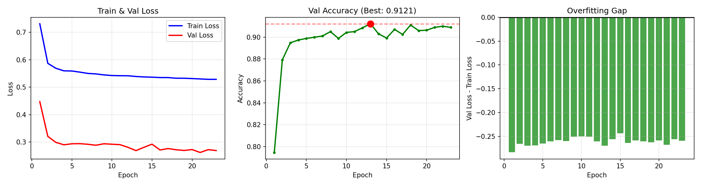
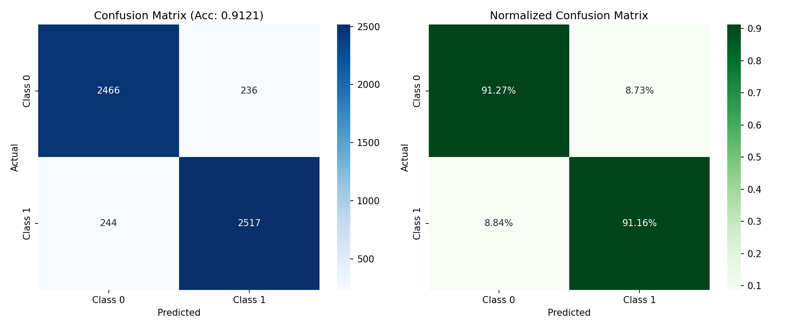
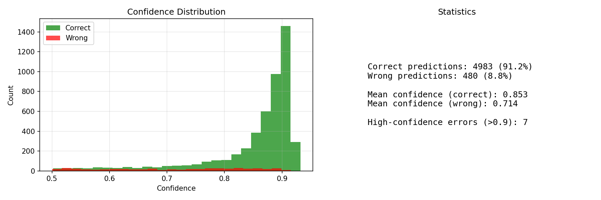

#  QNLI Probe: Извлечение знаний из Hidden States LLM

Исследование эффективности probe-классификаторов на внутренних представлениях языковой модели Qwen2.5-0.5B для задачи QNLI.

## 🎯 Цель проекта

Показать, что **обучение на hidden states** LLM значительно превосходит zero-shot генерацию для специализированных задач понимания языка.

## 📊 Ключевые результаты

| Метод | Val Accuracy | Описание |
|-------|--------------|----------|
| LLM Zero-Shot | 57.92% | Генерация yes/no без обучения |
| MLPProbe (layer 14) | 83.93% | MLP на одном слое |
| **HybridProbe** | **91.36%** | Multi-layer fusion + регуляризация |

**Улучшение**: +33.44% по сравнению с zero-shot 🚀

## 🏗️ Архитектура решения

                                Qwen2.5-0.5B (frozen)
                                          |
                        +-----------------+-----------------+
                        |                 |                 |
                    Extra Layers      Main Layer        Extra Layers
                 [9, 10, 11, 12]         [13]          [14, 15, 16]
                        |                 |                 |
                     Pooled            Sequence           Pooled
                        |                 |                 |
                        |             Transformer           | 
                        |              Encoder              |
                        |                 |                 |
                        +---------> Weighted Fusion <-------+
                                        |
                                    Classifier
                                        |
                                      91.36%

## Структура проекта
├── config.py                    # Конфигурация  
├── src/  
│   ├── model.py                 # HybridProbe архитектура  
│   ├── data.py                  # Загрузка данных и hidden states  
│   ├── trainer.py               # Training loop  
│   ├── losses.py                # Label Smoothing, R-Drop  
│   └── utils.py                 # Вспомогательные функции  
├── scripts/  
│ ├── train.py # Скрипт обучения  
│ └── evaluate.py # Скрипт оценки и визуализации  
├── results/  
│   ├── best_model/              # Результаты и описание экспериментов с лучшей моделью  
│   ├── best-layer-search/       # Результаты анализы слоев LLM  
│   └── llm_baseline/            # Результаты чистой LLM  
└── outputs/  
    └── best_light_model.pt            # Лучшая модель 


## Эксперименты
### 1. Анализ слоёв (MLPProbe)
Поиск оптимальных слоёв для извлечения семантической информации.

- **Лучшие слои**: 13-14 (~85% accuracy)
- **Вывод**: Средние слои содержат больше семантики

### 2. HybridProbe (Multi-layer Fusion)

Объединение информации из 8 слоёв с сильной регуляризацией.

| Метрика | Train | Validation |
|---------|-------|------------|
| Accuracy | 91.61% | 91.36% |
| F1-Score | 0.9161 | 0.9136 |

**Overfitting gap**: 0.25% ✅

### 3. LLM Zero-Shot Baseline

Оценка генеративных способностей модели без обучения.

- **Accuracy**: 57.92%
- **Вывод**: Маленькие LLM не справляются с QNLI в zero-shot

## 🔧 Установка и запуск

### Установка

```bash
git clone https://github.com/ravil75/DL_PROJECT.git
cd DL_PROJECT
pip install -r requirements.txt 
```

### Обучение 
```python
python scripts/train.py
```

## Визуализации

| Training Curves | Confusion Matrix |
|:---------------:|:----------------:|
|  |  |

| Confidence Analysis |
|:-------------------:|
|  |

## Основные выводы
1. Hidden states > Generation: Probe на скрытых состояниях даёт +33% accuracy

2. Регуляризация критична: Без неё overfitting

3. Средние слои оптимальны: Слои 13-14 содержат максимум семантики


##  Технические детали
| Параметр      | Значение                      |
| ------------- | ----------------------------- |
| Base LLM      | Qwen2.5-0.5B (896 hidden dim) |
| Main layer    | 13                            |
| Extra layers  | [9, 10, 11, 12, 14, 15, 16]   |
| Dropout       | 0.4                           |
| Learning rate | 5e-5                          |
| Batch size    | 64                            |

## Датасет

 - GLUE QNLI (Question-answering NLI)

 - Train: 104 743 примеров

 - Validation: 5 463 примеров

 - Задача: Определить, содержит ли предложение ответ на вопрос
